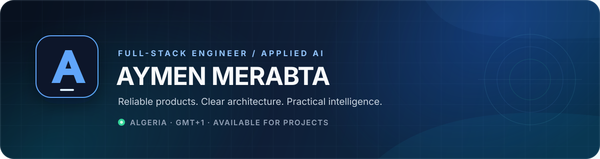
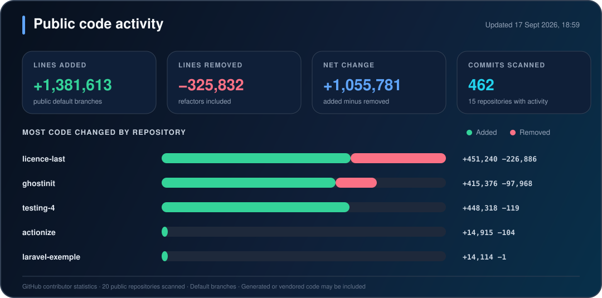

  

  
  
  

## About me

I'm a full-stack engineer based in Algeria, building the software businesses run on. I turn product ideas into maintainable systems across the interface, backend, data layer, and deployment pipeline.

Alongside product engineering, I explore applied AI through computer vision, LLM fine-tuning, and from-scratch implementations of foundational machine-learning concepts.

- Shipped **7 systems** across commerce, healthcare, e-learning, and other domains
- Build primarily with **TypeScript, Next.js, React, Node.js, PostgreSQL, and Python**
- Interested in **software architecture, developer tooling, reliable AI systems, and excellent product UX**
- Currently **accepting new projects and professional collaborations**

## Selected product work

| Project | What it is | Status |
| --- | --- | :---: |
| **Trendora** | A complete commerce platform designed around real business operations | Shipped |
| **Helix** | A hospital-management system that brings core clinical workflows into one product | Shipped |
| **Lumin** | A website builder with support for an Algerian payment gateway | In development |

Explore the case studies and more shipped work on my **[portfolio](https://aymen-merabta.vercel.app/)**.

## Featured engineering projects

| Project | Highlights | Stack |
| --- | --- | --- |
| **[Stag](https://github.com/aymenmerabta5/licence-last)** | Full internship-lifecycle platform connecting Algerian students, universities, and companies | Next.js 16, React 19, Better Auth, Drizzle, PostgreSQL |
| **[Nutrify](https://github.com/aymenmerabta5/nutrify-food-vit)** | End-to-end Food-101 classifier with a ViT model, inference API, and upload interface | PyTorch, FastAPI, Next.js |
| **[LLM Fine-Tuning Toolkit](https://github.com/aymenmerabta5/llm-finetuning-toolkit)** | Runnable projects for causal language modeling, named-entity recognition, and summarization | Transformers, PEFT, LoRA, Python |
| **[ViT from Scratch](https://github.com/aymenmerabta5/vit-from-scratch-pizza-steak-sushi)** | A compact Vision Transformer paper replication with patch, class-token, and positional embeddings | PyTorch, Python |

## GitHub by the numbers

  

  

  
  

  

  Locally generated GitHub cards refresh automatically on a five-minute cycle; the contribution, streak, and language services may use their own caches. Code-line totals use GitHub's asynchronously computed contributor statistics for original, non-archived code repositories (excluding this generated profile repository) and may briefly lag after a push or visibility change. Generated or vendored code may be included.

## Technology stack

**Product engineering**

**Data and backend**

**AI and machine learning**

**Delivery and tooling**

## How I work

1. **Clarify the outcome** — define scope, constraints, and success criteria before implementation.
2. **Design the system** — choose an architecture that stays understandable as the product grows.
3. **Ship in visible increments** — share working builds early and keep progress easy to evaluate.
4. **Deliver with ownership** — document the system and leave the codebase ready for its next engineer.

## Let's build something useful

If you need a full-stack product, a stronger software architecture, or help turning an AI prototype into a usable system, I'd be glad to hear about it.

  <a href="mailto:aymenmerabta12@gmail.com"><strong>Email me</strong></a>
  &nbsp;&nbsp;•&nbsp;&nbsp;
  <a href="https://aymen-merabta.vercel.app/"><strong>View my portfolio</strong></a>
  &nbsp;&nbsp;•&nbsp;&nbsp;
  <a href="https://github.com/aymenmerabta5?tab=repositories"><strong>Browse my repositories</strong></a>

Based in Algeria · GMT+1 · Usually replies within one business day

